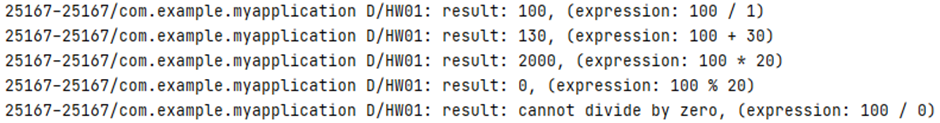

# Assignment #1

### Requirements

- Use Kotlin.
- Attatch your codes itself.
- Attatch your output.
- For each solution you wrote, you MUST give comments for important lines.

---

1. Write a simple calculator program. The available arithmetic operators are +, -, *, and / operators. Operands and operator must be separated by whitespaces. The program must print “Cannot divide by 0” string when a user tries to “divide by 0” operation. Use “when” statement for operator branch.

```kotlin
val expression = "100 / 0" // modify this line for test

// implement here

Log.d("HW01", "result: $result, (expression: $expression)")
```

- Output example:



- Your code
    
    ```kotlin
    /* Write your code here */
    ```
    
- Output Screenshot:
    
    
1. Write a program that 
    
    1) takes a positive integer number N (less than 100)
    
    2) creates an integer array with the size of N
    
    3) fills in this array using a set of random numbers ranging from 1~100
    
    4) prints out the numbers in this array. 
    
    Note that this array MUST NOT have the duplicate numbers.
    

```kotlin
val capacity = 10 // modify this for test

// implement here

Log.d("HW01", "result: $myUniqueArray, capacity: $capacity")
```

- Output example:
    
    
    
- Your code
    
    ```kotlin
    /* Write your code here */
    ```
    
- Output Screenshot:

1. **Write a program that initializes an array consisting of some string lines and counts the words in each string line.**

```kotlin
val strLine =

*… // initialize string array with string lines*

*/* Following is an example set of string lines*

"Seoul National University of Science and Technology",

"Seoul Station",

"IT Management",

"Android and Kotlin is not that difficult",

"Exit"

- /

// implement here
```

- Output Example
    
    
    
- Your code
    
    ```kotlin
    /* Write your code here */
    ```
    
- Output Screenshot:

1. Write a program that takes a string, rotates it one character at a time, and prints it all.

```kotlin
var str = "I Love Kotlin" // modify this for test

Log.d("HW01",str)

// implement here
```

- Expected Output
    
    
    
- Your code
    
    ```kotlin
    /* Write your code here */
    ```
    
- Output Screenshot:
1. Write a code to check if a given string is palindrome or not.

```kotlin
val str = "jinwoo" // modify this for test

// implement here
```

- Expected Output
    
    
    
- Your code
    
    ```kotlin
    /* Write your code here */
    ```
    
- Output Screenshot:

1. Given a positive integer (10-99), write a program to check if the digits in the tens place and the ones place are the same.

```kotlin
**val** testNum = 99;

// implement here
```

- Expected Output
    
    
    
- Your code
    
    ```kotlin
    /* Write your code here */
    ```
    
- Output Screenshot:

1. Write a program to count the number of alphabets present in a given string using a Map collection.

```kotlin
val sequence = "abcabcdefabc"

// implement here
```

- Expected Output
    
    
    
- Your code
    
    ```kotlin
    /* Write your code here */
    ```
    
- Output Screenshot: